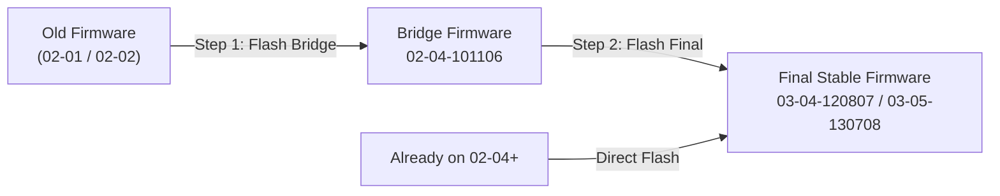

# 💾 Popcorn Hour Firmware, Bridge & Emergency Recovery Guide

A complete reference and digital preservation archive for **Popcorn Hour** (Syabas / Cloud Media) devices.

---

## ⚡ Quick Understanding: Software vs. Firmware

Before updating or modifying your device, understand the difference:

| Category | What it is | Compatibility | Risk Level |
| :--- | :--- | :--- | :--- |
| **🧰 Modern Toolkit (`pch-toolkit`)** | Standalone userland binaries (`pch_remote`, `dropbear`, `busybox`, `curl`, `nano`, `python`, `stremio`). | **Universal** across MIPS Linux 2.6 devices (A-200, A-210, C-200, A-300, C-300). Runs from USB / `/share`. | **Zero risk** (100% non-destructive, does not touch internal flash ROM). |
| **💾 Firmware (`.bin`, `.zip`)** | Low-level OS, kernel, and bootloader written directly to onboard NAND flash memory. | **Strictly model-specific**. Flashing the wrong model file will brick the player. | **High care required** (Follow upgrade steps closely). |

---

## 🧭 The A-200 / A-210 Firmware Upgrade Path

Because official Cloud Media update servers (`files.syabas.com`, `update.popcornhour.com`) are permanently offline, all updates must be performed locally via USB.

### ⚠️ The "Bridge Firmware" Rule (Crucial)
In November 2010, Syabas restructured the internal NAND flash partition tables and expanded the bootloader partition. 
* **If your current firmware version starts with `02-01` or `02-02`:**  
  You **MUST NOT** jump directly to `03-04` or `03-05`. Doing so will fail or soft-brick your device.
* You **MUST** install the intermediate **Bridge Firmware** (`02-04-101106-21-POP-411-000`) first. Once your unit reboots on `02-04`, you can safely flash the final release.

---

## 📦 Download Vault & Verification Hashes

All files below are archived and verified with SHA-256 checksums to ensure file integrity.

### 1. A-200 / A-210 & C-200 Core Lineage

| Package | Size | SHA-256 Checksum | Purpose / Description | Download Link |
| :--- | :--- | :--- | :--- | :--- |
| **`A200_recovery_091114.zip`** | 36.2 MB | `2278c1e51409f669e4ceec20ecb8d003...` | 🚨 **Emergency USB Unbricker** (A-200 / A-210) | [Download](https://github.com/sdoolman/pch-toolkit/releases/download/firmware-vault/A200_recovery_091114.zip) |
| **`c200_recovery_090729.zip`** | 44.1 MB | `ef3bc5f72a1633ec7c3eb238b71d4bf5...` | 🚨 **Emergency USB Unbricker** (C-200) | [Download](https://github.com/sdoolman/pch-toolkit/releases/download/firmware-vault/c200_recovery_090729.zip) |
| **`02-02-100428-19-POP-411-000.zip`** | 58.5 MB | `1451fb50c3450de7e997f7bbcfcf5367...` | Factory Baseline Release (April 2010) | [Download](https://github.com/sdoolman/pch-toolkit/releases/download/firmware-vault/02-02-100428-19-POP-411-000.zip) |
| **`02-04-101106-21-POP-411-000.zip`** | 64.5 MB | `dbd9d251a8d585348981f4f56f14061a...` | 🌉 **Required Bridge / Step Firmware** (Nov 2010) | [Download](https://github.com/sdoolman/pch-toolkit/releases/download/firmware-vault/02-04-101106-21-POP-411-000.zip) |
| **`03-04-120807-21-POP-411-000.zip`** | 66.2 MB | `2e8e78bc19ec335d1db9675ad7040fdc...` | Production Stable Firmware (NMJ v2, Transmission 2.13) | [Download](https://github.com/sdoolman/pch-toolkit/releases/download/firmware-vault/03-04-120807-21-POP-411-000.zip) |
| **`A200_A210_03-05-130708-21-POP-411-000.7z`** | 76.9 MB | `88241f259ccc7bc4a7375bf42ec313e6...` | 🏁 **Final Official Syabas Release** (July 2013) | [Download](https://github.com/sdoolman/pch-toolkit/releases/download/firmware-vault/A200_A210_03-05-130708-21-POP-411-000.7z) |

---

### 2. Complete Popcorn Hour Fleet Archives (`nmtcsi`)

Preserved courtesy of the [vaidyasr/nmtcsi](https://github.com/vaidyasr/nmtcsi) repository:

| Model | SoC / Hardware | Archive Package | Size | SHA-256 Checksum | Download |
| :--- | :--- | :--- | :--- | :--- | :--- |
| **A-100** | SMP8635 | `A100_01-17-110314-15-POP-402-000.7z` | 56.9 MB | `e5563a45607b0eb5...` | [Download](https://github.com/sdoolman/pch-toolkit/releases/download/firmware-vault/A100_01-17-110314-15-POP-402-000.7z) |
| **A-110** | SMP8635 | `A110_01-17-110314-15-POP-403-000.7z` | 56.9 MB | `7e2f02e4e5bd57e3...` | [Download](https://github.com/sdoolman/pch-toolkit/releases/download/firmware-vault/A110_01-17-110314-15-POP-403-000.7z) |
| **A-200 / A-210** | SMP8643 | `A200_A210_03-05-130708-21-POP-411-000.7z` | 76.9 MB | `88241f259ccc7bc4...` | [Download](https://github.com/sdoolman/pch-toolkit/releases/download/firmware-vault/A200_A210_03-05-130708-21-POP-411-000.7z) |
| **A-300** | SMP8647 | `A300_05-03-140117-23-POP-421-000.7z` | 85.5 MB | `3b049d04188ce6b2...` | [Download](https://github.com/sdoolman/pch-toolkit/releases/download/firmware-vault/A300_05-03-140117-23-POP-421-000.7z) |
| **A-400** | SMP8911 | `A400_05-08-150120-25-pop-422-802.7z` | 71.3 MB | `4b5c80b09a2c358f...` | [Download](https://github.com/sdoolman/pch-toolkit/releases/download/firmware-vault/A400_05-08-150120-25-pop-422-802.7z) |
| **A-410** | SMP8911 | `A410_05-08-131101-25-POP-425-802.7z` | 71.2 MB | `f72a3e945903c7ea...` | [Download](https://github.com/sdoolman/pch-toolkit/releases/download/firmware-vault/A410_05-08-131101-25-POP-425-802.7z) |
| **A-500** | SMP8758 | `A500_01-05-161214-25-POP-432-802.7z` | 77.4 MB | `46bab1ecafe701b2...` | [Download](https://github.com/sdoolman/pch-toolkit/releases/download/firmware-vault/A500_01-05-161214-25-POP-432-802.7z) |
| **A-500 Pro** | SMP8758 | `A500Pro_01-05-161214-25-POP-430-802.7z` | 77.4 MB | `57f4f51e39b3ff89...` | [Download](https://github.com/sdoolman/pch-toolkit/releases/download/firmware-vault/A500Pro_01-05-161214-25-POP-430-802.7z) |
| **A-500U** | SMP8758 | `A500U_01-05-161214-25-POP-433-802.7z` | 77.4 MB | `3a3f67d1e1a72a11...` | [Download](https://github.com/sdoolman/pch-toolkit/releases/download/firmware-vault/A500U_01-05-161214-25-POP-433-802.7z) |
| **C-200** | SMP8643 | `C200_03-05-130708-21-POP-408-000.7z` | 84.1 MB | `2c91bdb5c458bb03...` | [Download](https://github.com/sdoolman/pch-toolkit/releases/download/firmware-vault/C200_03-05-130708-21-POP-408-000.7z) |
| **C-300** | SMP8647 | `C300_05-03-140117-23-POP-420-000.7z` | 88.8 MB | `4c34067a8fd7e0ca...` | [Download](https://github.com/sdoolman/pch-toolkit/releases/download/firmware-vault/C300_05-03-140117-23-POP-420-000.7z) |
| **VTEN** | SMP8757 | `VTEN_01-05-161214-25-POP-427-802.7z` | 75.2 MB | `6e7886a34e815e12...` | [Download](https://github.com/sdoolman/pch-toolkit/releases/download/firmware-vault/VTEN_01-05-161214-25-POP-427-802.7z) |
| **PopBox V8**| SMP8670 | `V8_05-03-131128-23-POP-418-000.7z` | 60.1 MB | `d9b4f85c8a599661...` | [Download](https://github.com/sdoolman/pch-toolkit/releases/download/firmware-vault/V8_05-03-131128-23-POP-418-000.7z) |
| **S-210** | SMP8635 | `S210_31-15-090416-14-POP-406-000.7z` | 22.3 MB | `132b9f9aac3f1d3c...` | [Download](https://github.com/sdoolman/pch-toolkit/releases/download/firmware-vault/S210_31-15-090416-14-POP-406-000.7z) |
| **S-300** | SMP8647 | `S300_05-03-140114-23-POP-419-000.7z` | 44.5 MB | `a4415907a411cf46...` | [Download](https://github.com/sdoolman/pch-toolkit/releases/download/firmware-vault/S300_05-03-140114-23-POP-419-000.7z) |

---

## 🛠️ Step-by-Step USB Firmware Flashing Guide

1. **Format a USB Flash Drive:**
   * Format as **FAT32** with **MBR** partition scheme (max 32GB partition recommended).
2. **Unpack the Firmware Package:**
   * Extract the `.zip` archive directly to the root of your USB drive.
   * You should see:
     * `<version>.bin`
     * `apps.nmt` (if bundled)
     * `usbupdate.html`
3. **Flash on the Popcorn Hour:**
   * Plug the USB drive into one of the Popcorn Hour USB ports.
   * **Method A (Recommended):** Navigate on your TV to **Setup** > **Maintenance** > **Firmware Update**, select **USB**, and confirm the update.
   * **Method B:** Navigate to **Media Sources** > **USB Drive**, open `usbupdate.html`, and press the update link on screen.
4. **DO NOT INTERRUPT POWER:**
   * The TV screen will turn blue/black and show a flashing progress bar.
   * When complete, the unit will prompt you to press Enter or automatically reboot.

---

## 🚨 Emergency USB Recovery (Un-Bricking Guide)

If your Popcorn Hour won't boot, shows a black screen, or the front power LED is stuck blinking orange/red:

1. **Format a USB flash drive as FAT32 (slow/full format recommended).**
2. **Download the Emergency Recovery Package:**
   * For **A-200 / A-210**: Download [`A200_recovery_091114.zip`](https://github.com/sdoolman/pch-toolkit/releases/download/firmware-vault/A200_recovery_091114.zip).
   * For **C-200**: Download [`c200_recovery_090729.zip`](https://github.com/sdoolman/pch-toolkit/releases/download/firmware-vault/c200_recovery_090729.zip).
3. **Extract `recovery-image.bin`:**
   * Place `recovery-image.bin` directly onto the **root directory** of the FAT32 USB drive.
4. **Trigger Emergency Flash:**
   * Power OFF the Popcorn Hour completely (unplug power cable).
   * Plug the USB drive into the **front USB port**.
   * Reconnect the power cable while keeping an eye on the front LED:
     * The player will detect the recovery binary on USB during early boot.
     * The front LED will start blinking rhythmically or change color while rewriting the flash sectors.
     * **Wait 5 to 10 minutes.** Do not unplug power.
   * When flashing finishes, the LED will stabilize or turn off. Unplug the USB drive and power cycle the player.
   * The device will boot back into the factory initial setup wizard!

---

## 🏛️ Digital Preservation Mirror

* **GitHub Release Vault:** [https://github.com/sdoolman/pch-toolkit/releases/tag/firmware-vault](https://github.com/sdoolman/pch-toolkit/releases/tag/firmware-vault)
* **Internet Archive Collection:** [Popcorn Hour Preservation Vault (archive.org)](https://archive.org/details/popcorn-hour-firmware-vault)
* **NMT CSI Community Packages:** Preserved at [vaidyasr/nmtcsi](https://github.com/vaidyasr/nmtcsi).
